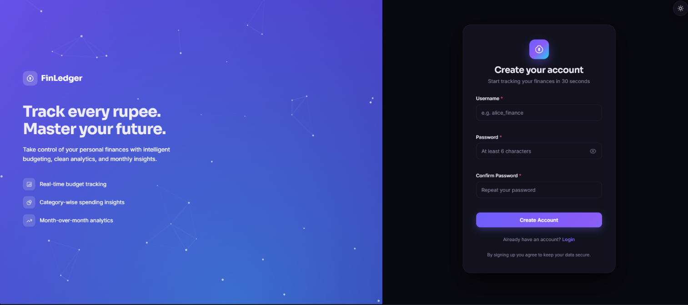
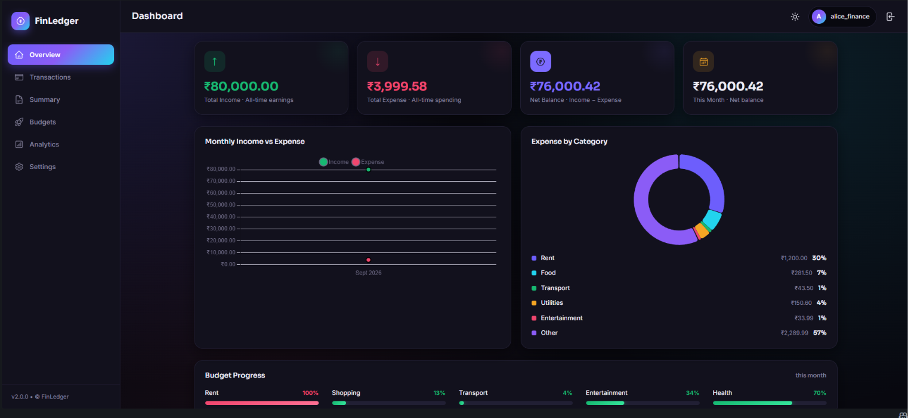
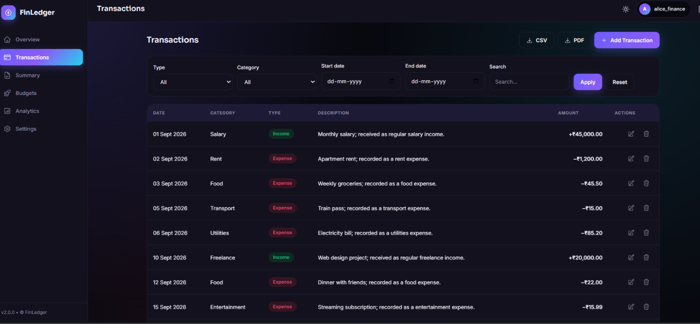
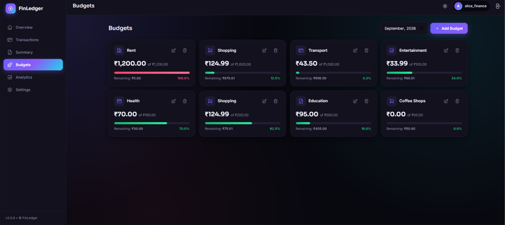
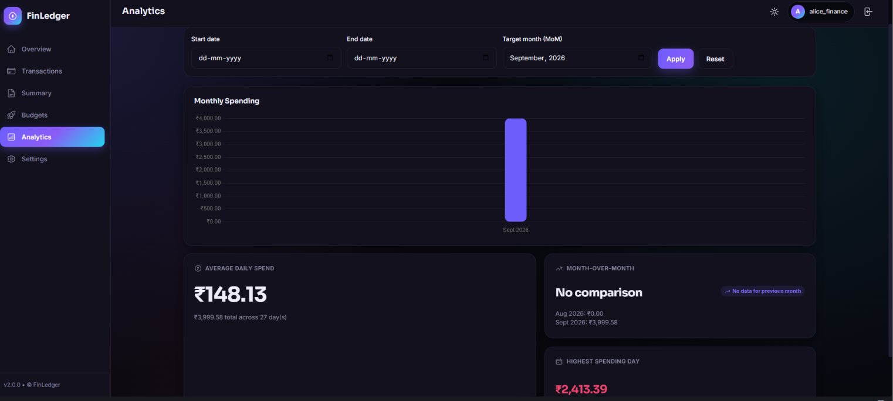

<div align="center">

# 💰 FinLedger

### Personal Finance Tracker API & Dashboard

Track income, expenses, budgets, and spending patterns through a secure FastAPI application with a responsive web dashboard.


</div>

---

## Overview

**FinLedger** is a full-stack personal finance tracker built with **FastAPI, Jinja2, Vanilla JavaScript, and JSON storage**.

The application allows users to securely manage their financial transactions, create budgets, analyze spending patterns, and visualize their financial activity through a responsive dashboard.

### Key Capabilities

* Secure user authentication with JWT
* Transaction management with CRUD operations
* Budget creation and spending tracking
* Financial analytics and summaries
* Recurring transaction processing
* CSV import and export
* PDF statement generation
* Responsive dashboard
* Dark mode
* Structured application logging
* Interactive Swagger API documentation

---

## Features

### Authentication

* JWT-based authentication
* Password hashing with bcrypt
* Token expiration
* Token revocation on logout
* Login rate limiting
* Change password functionality
* User ownership validation

### Transactions

* Create, read, update, and soft-delete transactions
* Filter transactions by:

  * Type
  * Category
  * Date range
  * Search text
* Pagination with `skip` and `limit`
* Recurring transaction processing
* CSV import and export
* PDF statement generation

### Budgets

* Create monthly budgets by category
* Track spending against budget limits
* Budget status:

  * `on_track`
  * `warning`
  * `exceeded`
* Prevent duplicate active budgets
* Soft-delete support

### Analytics

* Average daily spending
* Month-over-month comparison
* Highest spending day
* Category-wise spending breakdown
* Income and expense trends
* Percentage-based category analysis

### Dashboard

* Financial overview
* Income and expense summaries
* Recent transactions
* Budget alerts
* Spending charts
* Responsive layout
* Dark mode
* Skeleton loading states
* Toast and confirmation dialogs

---

## Screenshots

### Authentication

| Register | Login |
|---|---|
|  |  |

| Dashboard — Overview | Transactions |
|---|---|
|  |  |

| Budgets | Analytics |
|---|---|
|  |  |


---

## Tech Stack

| Layer             | Technology                        |
| ----------------- | --------------------------------- |
| Backend           | **FastAPI**                       |
| Language          | **Python 3.11+**                  |
| Authentication    | **JWT + bcrypt**                  |
| Storage           | **JSON**                          |
| Templating        | **Jinja2**                        |
| Frontend          | **HTML, CSS, Vanilla JavaScript** |
| Charts            | **Chart.js**                      |
| PDF Generation    | **fpdf2**                         |
| Package Manager   | **uv**                            |
| API Documentation | **Swagger UI / ReDoc**            |

---

## Project Architecture

```text
FinLedgerAPI/
│
├── backend/
│   ├── app/
│   │   ├── main.py
│   │   ├── config.py
│   │   ├── models/
│   │   ├── enums/
│   │   ├── routes/
│   │   ├── utils/
│   │   ├── templates/
│   │   └── static/
│   │
│   ├── data/
│   │   └── transactions.json
│   │
│   ├── logs/
│   ├── pyproject.toml
│   └── uv.lock
│
├── docs/
│   └── screenshots/
│
├── .gitignore
├── LICENSE
└── README.md
```

### Backend Structure

```text
app/
├── main.py       # FastAPI application and route registration
├── config.py     # Environment configuration
├── models/       # Pydantic request/response models
├── enums/        # Application enums
├── routes/       # API route modules
├── utils/        # Data, security and logging utilities
├── templates/    # Jinja2 HTML templates
└── static/       # CSS and JavaScript assets
```

---

## Run Locally

### Prerequisites

* Python 3.11+
* [uv](https://docs.astral.sh/uv/)
* Git

### 1. Clone the Repository

```bash
git clone https://github.com/Harshadachaudhariii/FinLedgerAPI.git
cd FinLedgerAPI/backend
```

### 2. Install Dependencies

```bash
uv sync
```

### 3. Configure Environment Variables

Create a `.env` file inside the `backend` directory:

```env
SECRET_KEY=your-secret-key
ALGORITHM=HS256
ACCESS_TOKEN_EXPIRE_MINUTES=30
```

Generate a secure secret key with:

```bash
python -c "import secrets; print(secrets.token_hex(32))"
```

> Never commit your `.env` file or expose your `SECRET_KEY`.

### 4. Start the Application

```bash
uv run uvicorn app.main:app --reload --port 8000
```

### 5. Access the Application

| URL                         | Purpose                   |
| --------------------------- | ------------------------- |
| http://localhost:8000       | Web dashboard             |
| http://localhost:8000/docs  | Swagger API documentation |
| http://localhost:8000/redoc | ReDoc API documentation   |

### Application Flow

```text
Register
   ↓
Login
   ↓
Dashboard
   ↓
Transactions / Budgets / Analytics
```

---

## API Reference

FinLedger provides REST APIs for authentication, transactions, budgets, summaries, and analytics.

Interactive API documentation is available at:

```text
http://localhost:8000/docs
```

### Authentication

| Method | Endpoint                 | Description                  |
| ------ | ------------------------ | ---------------------------- |
| `POST` | `/users/register`        | Create a new account         |
| `POST` | `/users/login`           | Authenticate and receive JWT |
| `GET`  | `/users/me`              | Get current user             |
| `POST` | `/users/logout`          | Revoke current token         |
| `PUT`  | `/users/change-password` | Change password              |

### Transactions

| Method   | Endpoint                          | Description                    |
| -------- | --------------------------------- | ------------------------------ |
| `GET`    | `/transactions`                   | List transactions              |
| `GET`    | `/transactions/filter`            | Filter transactions            |
| `GET`    | `/transactions/{id}`              | Get a transaction              |
| `POST`   | `/transactions/create`            | Create transaction             |
| `PUT`    | `/transactions/update/{id}`       | Update transaction             |
| `DELETE` | `/transactions/delete/{id}`       | Soft-delete transaction        |
| `POST`   | `/transactions/import-csv`        | Import transactions            |
| `GET`    | `/transactions/export-csv`        | Export transactions            |
| `GET`    | `/transactions/export-pdf`        | Generate PDF statement         |
| `POST`   | `/transactions/process-recurring` | Process recurring transactions |

### Summaries

| Method | Endpoint                            | Description                            |
| ------ | ----------------------------------- | -------------------------------------- |
| `GET`  | `/transactions/summary/overview`    | Income, expense, net balance and count |
| `GET`  | `/transactions/summary/by-category` | Category spending breakdown            |
| `GET`  | `/transactions/summary/monthly`     | Monthly income and expense totals      |
| `GET`  | `/transactions/dashboard`           | Dashboard summary                      |

### Budgets

| Method   | Endpoint                   | Description            |
| -------- | -------------------------- | ---------------------- |
| `GET`    | `/api/budgets`             | List budgets           |
| `GET`    | `/api/budgets/status`      | Budget spending status |
| `GET`    | `/api/budgets/{id}`        | Get budget             |
| `POST`   | `/api/budgets/create`      | Create budget          |
| `PUT`    | `/api/budgets/update/{id}` | Update budget          |
| `DELETE` | `/api/budgets/delete/{id}` | Soft-delete budget     |

### Analytics

| Method | Endpoint                              | Description                      |
| ------ | ------------------------------------- | -------------------------------- |
| `GET`  | `/api/analytics/average-daily-spend`  | Calculate average daily spending |
| `GET`  | `/api/analytics/month-over-month`     | Compare monthly spending         |
| `GET`  | `/api/analytics/highest-spending-day` | Find highest spending day        |

### System

| Method | Endpoint  | Description              |
| ------ | --------- | ------------------------ |
| `GET`  | `/health` | Application health check |

---


## Security

FinLedger implements several security measures:

* JWT-based authentication
* Password hashing with bcrypt
* Configurable token expiration
* Token revocation on logout
* Login rate limiting
* User ownership validation
* Soft deletion for financial records
* Environment-based secret configuration
* CORS configuration

### Production Considerations

Before deploying to production:

* Use a strong `SECRET_KEY`
* Restrict CORS origins
* Move token blocklists to persistent storage such as Redis
* Replace JSON storage with a production database
* Enable HTTPS
* Keep secrets outside the repository

---

## Testing

The API can be tested directly through Swagger UI:

```text
http://localhost:8000/docs
```

### Basic Test Flow

1. Register a user
2. Login and obtain a JWT
3. Authorize Swagger using the token
4. Create transactions
5. Retrieve and filter transactions
6. Create a budget
7. Check budget status
8. View analytics
9. Test update and delete operations

### Edge Cases

The application handles cases such as:

* Invalid date ranges
* Duplicate budgets
* Deleted transactions
* Unauthorized resource access
* Repeated failed login attempts
* Month-end recurring transactions

---

## Roadmap

* [x] JWT authentication
* [x] Password hashing
* [x] Login rate limiting
* [x] Transaction CRUD
* [x] Soft deletion
* [x] Budget tracking
* [x] Financial analytics
* [x] CSV import/export
* [x] PDF statement export
* [x] Recurring transactions
* [x] Dashboard
* [x] Charts and dark mode


---

## Acknowledgements

* [FastAPI](https://fastapi.tiangolo.com/) — API framework
* [Heroicons](https://heroicons.com/) — interface icons
* [Chart.js](https://www.chartjs.org/) — data visualization
* [Poppins](https://fonts.google.com/specimen/Poppins) — heading typography
* [Inter](https://fonts.google.com/specimen/Inter) — body typography
* [fpdf2](https://py-pdf.github.io/fpdf2/) — PDF generation

---

<div align="center">

**FinLedger — Personal Finance Tracking with FastAPI**

[⬆ Back to top](#-finledger)

</div>
